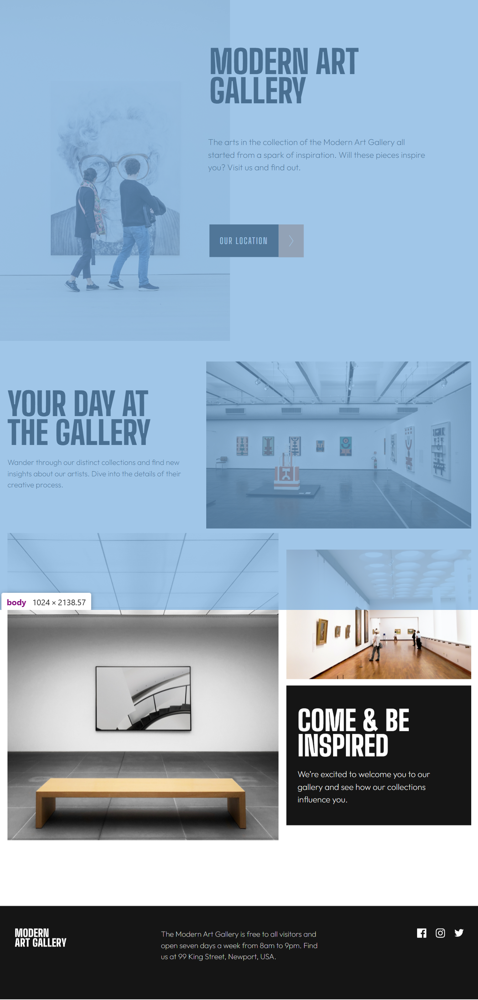
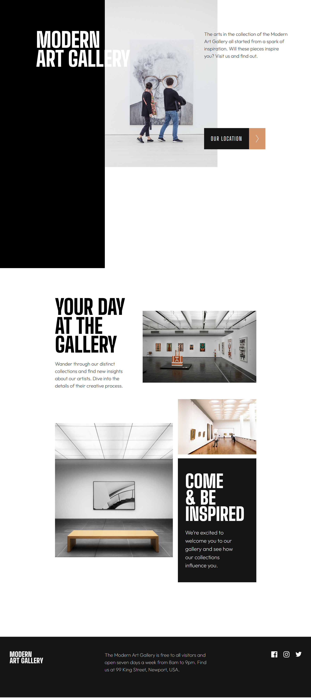

# Modern-Art-Gallery
Proyecto de una web moderna con responsive. Se utiliza HTML y CSS. 




## Tecnologías
- HTML5
- CSS3
- Sass
- Vite

## Instalación
1. Clona este repositorio
```bash
git clone https://github.com/IanBejenaru/Modern-Art-Gallery.git